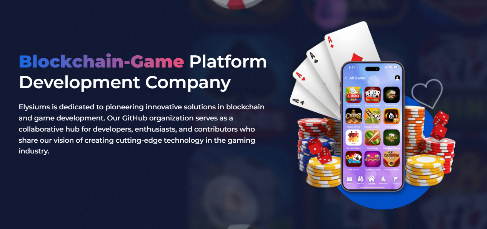

# Elysiums

We **Elysiums** believe in learning and growing together as a team. Our team does not just deliver app but adds value to your business as well to enhance your customer engagement and shoots up your ROI graph. We believe in the perfect blend of life, fun & work for our team. We motivate our employees with rewards & recognition as they are an integral part of the business. Because we appreciate and recognize the importance of hard work, our team always pushes that extra mile to ensure they produce top notch & creative outcomes for our clients.

## Our Mission
At Elysiums, our mission is to empower developers and gamers alike by providing open-source tools and resources that enhance the gaming experience through blockchain technology. We believe in collaboration and transparency, fostering a community where ideas can flourish.

## What We Do

- **Game Development**: We develop secure and scalable blockchain-based games that offer players unique ownership of in-game assets through NFTs and smart contracts.
- **Web Development**: Our web development services provide robust and user-friendly platforms that serve as the backbone for your gaming projects.
- **Mobile App Development**: Our team creates high-quality mobile applications that leverage blockchain technology, ensuring seamless integration and enhanced user experience.
- **Blockchain Development**: Our blockchain development services enable you to leverage decentralized technology for your gaming projects. By integrating blockchain, we provide innovative features that enhance gameplay and build trust within gaming communities.

At Elysiums, we are passionate about pushing the boundaries of what's possible in gaming. We harness the power of blockchain to create transparent, fair, and exciting gaming environments, ensuring that players and developers alike benefit from the future of gaming technology.

---
*Join us on our journey to revolutionize the gaming industry!*
